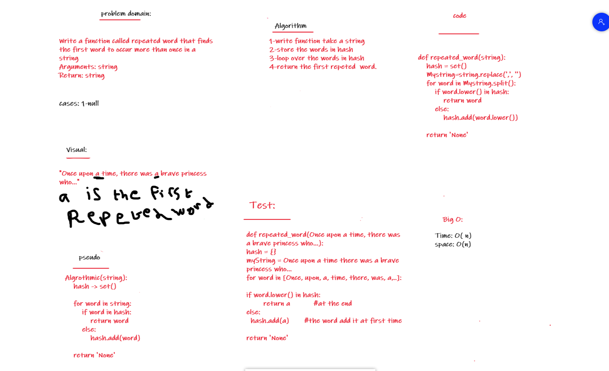

# Challenge Summary
Write a function called repeated word that finds the first word to occur more than once in a string
Arguments: string
Return: string

## Whiteboard Process



## Code Link:
[hashmap-repeated-word](https://github.com/Obada-gh/data-structures-and-algorithms-401/tree/main/Data-Structures/python/hashmap-repeated-word/hashmap_repeated_word/word.py)

## Approach & Efficiency
big o(n)
space O(n)
there is some builtin methods.

## Solution
```
def repeated_word(string):
    hash = set()
    Mystring=string.replace(',', '')
    for word in Mystring.split():
        if word.lower() in hash:
            return word
        else:
            hash.add(word.lower())
    
    return 'None'
```