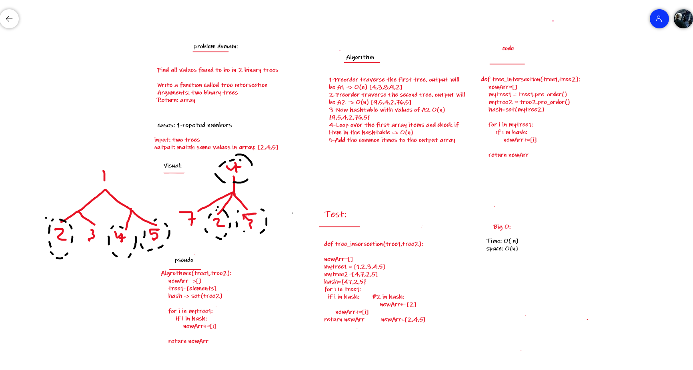

# Challenge Summary
Find all values found to be in 2 binary trees

Write a function called tree intersection
Arguments: two binary trees
Return: array

## Whiteboard Process



## Code Link:
[hashmap-tree-intersection](https://github.com/Obada-gh/data-structures-and-algorithms-401/tree/main/Data-Structures/python/hashmap-tree-intersection/hashmap_tree_intersection/treeHash.py)

## Approach & Efficiency
big o(n)
space O(n)


## Solution
```
class Binary_Tree:
    def __init__(self,value=None):
        self.value = value
        self.left = None
        self.right = None

    def add(self,value):
        if value == self.value:
            return
        if value < self.value:
            if self.left:
                self.left.add(value)
            else:
                self.left = Binary_Tree(value)
        
        if value > self.value:
            if self.right:
                self.right.add(value)
            else:
                self.right = Binary_Tree(value)
    
    def in_order(self):
        elements = []
        if self.left:
            elements += self.left.in_order()
        elements.append(self.value)

        if self.right:
            elements += self.right.in_order()
        
        return elements

    def pre_order(self):
        elements = [self.value]

        if self.left:
  
            elements += self.left.pre_order()
       

        if self.right:

            elements += self.right.pre_order()
        
        return elements


def build_tree(elements):
    root = Binary_Tree(elements[0])

    for i in range(1,len(elements)):
        root.add(elements[i])

    return root


nums1 = [17,4,1,20,9,23,18,34,18,4]
nums2 = [88,8,77,44,9,55,18,99,18,4]
nums_tree1 = build_tree(nums1)
nums_tree2 = build_tree(nums2)


def tree_intersection(tree1,tree2):
    newArr=[]
    mytree1 = tree1.pre_order()
    mytree2 = tree2.pre_order()
    hash=set(mytree2)

    for i in mytree1:
        if i in hash:
            newArr+=[i]
    
    return newArr


print(tree_intersection(nums_tree1,nums_tree2))
    
```