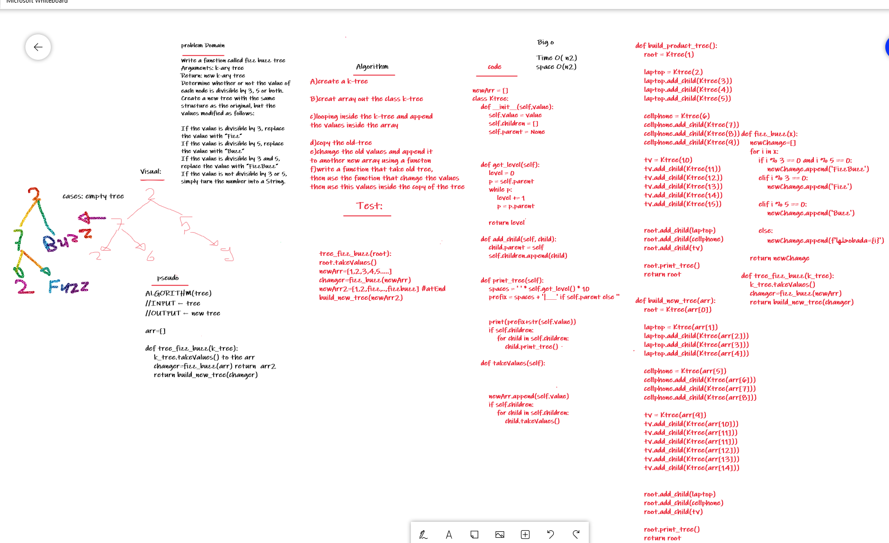

# Challenge Summary
Write a function called fizz buzz tree
Arguments: k-ary tree
Return: new k-ary tree
Determine whether or not the value of each node is divisible by 3, 5 or both. Create a new tree with the same structure as the original, but the values modified as follows:

If the value is divisible by 3, replace the value with “Fizz”
If the value is divisible by 5, replace the value with “Buzz”
If the value is divisible by 3 and 5, replace the value with “FizzBuzz”
If the value is not divisible by 3 or 5, simply turn the number into a String.

## Whiteboard Process


## Code Link:
[MyCode](https://github.com/Obada-gh/data-structures-and-algorithms-401/blob/main/Data-Structures/python/k-tree/k_tree/k_tree.py)

[youtube_help](https://www.youtube.com/watch?v=4r_XR9fUPhQ) helped in how to understand the implment of the k-tree


## Approach & Efficiency
cloned tree and new two arrays bad soluton big O (n2)

## Solution
```
newArr = []
class Ktree:
    def __init__(self,value):
        self.value = value
        self.children = []
        self.parent = None


    
    def get_level(self):
        level = 0
        p = self.parent
        while p:
            level += 1
            p = p.parent

        return level

    def add_child(self, child):
        child.parent = self
        self.children.append(child)


    def print_tree(self):
        spaces = ' ' * self.get_level() * 10
        prefix = spaces + '|___' if self.parent else ''
        
        
        print(prefix+str(self.value))
        if self.children:
            for child in self.children:
                child.print_tree()

    def takeValues(self):
        
        
        
        newArr.append(self.value)
        if self.children:
            for child in self.children:
                child.takeValues()
        
        

def build_product_tree():
    root = Ktree(1)

    laptop = Ktree(2)
    laptop.add_child(Ktree(3))
    laptop.add_child(Ktree(4))
    laptop.add_child(Ktree(5))

    cellphone = Ktree(6)
    cellphone.add_child(Ktree(7))
    cellphone.add_child(Ktree(8))
    cellphone.add_child(Ktree(9))

    tv = Ktree(10)
    tv.add_child(Ktree(11))
    tv.add_child(Ktree(12))
    tv.add_child(Ktree(13))
    tv.add_child(Ktree(14))
    tv.add_child(Ktree(15))
    

    root.add_child(laptop)
    root.add_child(cellphone)
    root.add_child(tv)

    root.print_tree()
    return root

    
def build_new_tree(arr):
    root = Ktree(arr[0])

    laptop = Ktree(arr[1])
    laptop.add_child(Ktree(arr[2]))
    laptop.add_child(Ktree(arr[3]))
    laptop.add_child(Ktree(arr[4]))

    cellphone = Ktree(arr[5])
    cellphone.add_child(Ktree(arr[6]))
    cellphone.add_child(Ktree(arr[7]))
    cellphone.add_child(Ktree(arr[8]))

    tv = Ktree(arr[9])
    tv.add_child(Ktree(arr[10]))
    tv.add_child(Ktree(arr[11]))
    tv.add_child(Ktree(arr[11]))
    tv.add_child(Ktree(arr[12]))
    tv.add_child(Ktree(arr[13]))
    tv.add_child(Ktree(arr[14]))
    

    root.add_child(laptop)
    root.add_child(cellphone)
    root.add_child(tv)

    root.print_tree()
    return root


def fizz_buzz(x):
    newChange=[]
    for i in x:
        if i % 3 == 0 and i % 5 == 0:
            newChange.append('FizzBuzz') 
        elif i % 3 == 0:
            newChange.append('Fizz') 
    
        elif i % 5 == 0:
            newChange.append('Buzz') 

        else:
            newChange.append(f'حلهاobada={i}') 
    
    return newChange

def tree_fizz_buzz(k_tree):
    k_tree.takeValues()
    changer=fizz_buzz(newArr)
    return build_new_tree(changer)


if __name__ == '__main__':
    old_tree=build_product_tree()  
    print('The new tree:')
    print(tree_fizz_buzz(old_tree))

```


