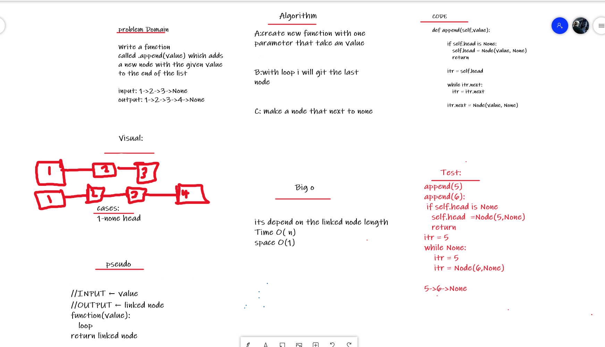

# Singly Linked List
A linked list is a sequence of data elements, which are connected together via links. Each data element contains a connection to another data element in form of a pointer. Python does not have linked lists in its standard library. We implement the concept of linked lists using the concept of nodes as discussed in the previous chapter. We have already seen how we create a node class and how to traverse the elements of a node. In this chapter we are going to study the types of linked lists known as singly linked lists. In this type of data structure there is only one link between any two data elements. We create such a list and create additional methods to insert, update and remove elements from the list.

## Challenge
-  Can successfully instantiate an empty linked list
-  Can properly insert into the linked list
-  The head property will properly point to the first node in the linked list
-  Can properly insert multiple nodes into the linked list
-  Will return true when finding a value within the linked list that exists
-  Will return false when searching for a value in the linked list that does not exist
-  Can properly return a collection of all the values that exist in the linked list

## whiteBoard process:

   

## Approach & Efficiency
Inserting an element at the beginning of a linked list is particularly nice and efficient because it takes the same amount of time, no matter how long our list is, which is to say it has a space time complexity that is constant, or O(1).

Hopefully, we can start to see what kind of space time complexity this type of inserting will leave us with: a linear O(n). If we had a linked list of 100 nodes, that might not actually take that long. Even a 1000 might be pretty fast. But imagine if we wanted to add an element to the end of a linked list with a billion items! This insert algorithm would take as much time as the number of elements in our list, which, depending on our list, could be a very bad day for us.

## code link:
 [linked list](./linked_list)
