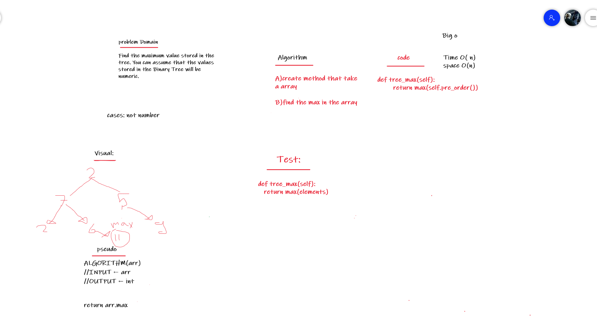
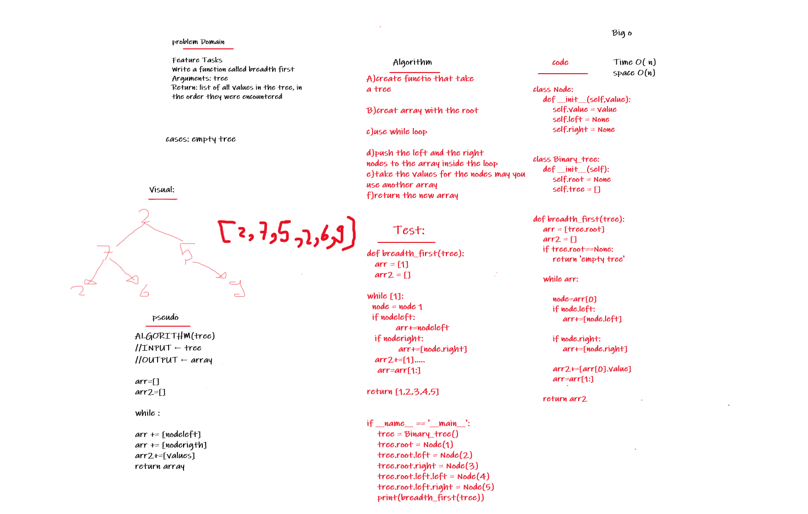

# Trees

Trees are non-linear data structures that represent nodes connected by edges. Each tree consists of a root node as the Parent node, and the left node and right node as Child nodes.

## Challenge

Write a function called breadth first
Arguments: tree
Return: list of all values in the tree, in the order they were encountered

## Whiteboard Process:
<!--  -->



## Solution:

```
class Node:
    def __init__(self,value):
        self.value = value
        self.left = None
        self.right = None 


class Binary_tree:
    def __init__(self):
        self.root = None
        self.tree = []


def breadth_first(tree):
    arr = [tree.root]
    arr2 = []
    if tree.root==None:
        return 'empty tree'
    
    while arr:
        
        node=arr[0]
        if node.left:
            arr+=[node.left]

        if node.right:
            arr+=[node.right]

        arr2+=[arr[0].value]
        arr=arr[1:]
        
    return arr2

if __name__ == '__main__':
    tree = Binary_tree()
    tree.root = Node(1)
    tree.root.left = Node(2)
    tree.root.right = Node(3)
    tree.root.left.left = Node(4)
    tree.root.left.right = Node(5)
    print(breadth_first(tree))
            
           

```


## Approach & Efficiency

The Big O time complexity for inserting a new node is O(n). Searching for a specific node will also be O(n). Because of the lack of organizational structure in a Binary Tree, the worst case for most operations will involve traversing the entire tree. If we assume that a tree has n nodes, then in the worst case we will have to look at n items, hence the O(n) complexity.

The Big O space complexity for a node insertion using breadth first insertion will be O(w), where w is the largest width of the tree. For example, in the above tree, w is 4.

A “perfect” binary tree is one where every non-leaf node has exactly two children. The maximum width for a perfect binary tree, is 2^(h-1), where h is the height of the tree. Height can be calculated as log n, where n is the number of nodes.

## Code Link:
[Code Link](https://github.com/Obada-gh/data-structures-and-algorithms-401/blob/main/Data-Structures/python/trees/trees/trees.py)

## API
I use this methods and functions:

input:tree

return : array with breadth first order for the tree

big o(n) space and time
