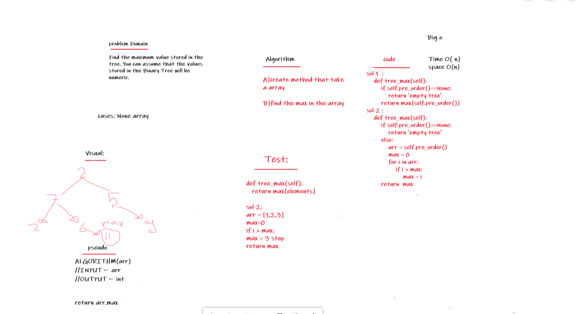

# Trees

Trees are non-linear data structures that represent nodes connected by edges. Each tree consists of a root node as the Parent node, and the left node and right node as Child nodes.

## Challenge

Node
Create a Node class that has properties for the value stored in the node, the left child node, and the right child node.
Binary Tree
Create a Binary Tree class
Define a method for each of the depth first traversals:
pre order
in order
post order which returns an array of the values, ordered appropriately.
Any exceptions or errors that come from your code should be semantic, capture-able errors. For example, rather than a default error thrown by your language, your code should raise/throw a custom, semantic error that describes what went wrong in calling the methods you wrote for this lab.
Binary Search Tree
Create a Binary Search Tree class
This class should be a sub-class (or your languages equivalent) of the Binary Tree Class, with the following additional methods:
Add
Arguments: value
Return: nothing
Adds a new node with that value in the correct location in the binary search tree.
Contains
Argument: value
Returns: boolean indicating whether or not the value is in the tree at least once.

## Whiteboard Process:
<!--  -->


## Solution:

```

# # in order traversal : your root in the middle you visit the left tree then right tree
# [7,12,14,15,20,23,27,88]
# # pre order traversal: your root first then left tree then right tree
# [15,12,7,14,27,20,23,88]
# # post order traversal: your root at the end then left tree then right tree 
# [7,14,12,23,20,88,27,15]
# # remember the child is root for the element below.

class Binary_Tree:
    def __init__(self,value=None):
        self.value = value
        self.left = None
        self.right = None

    def add(self,value):
        if value == self.value:
            return
        if value < self.value:
            if self.left:
                self.left.add(value)
            else:
                self.left = Binary_Tree(value)
        
        if value > self.value:
            if self.right:
                self.right.add(value)
            else:
                self.right = Binary_Tree(value)
    
    def in_order(self):
        elements = []
        if self.left:
            elements += self.left.in_order()
        elements.append(self.value)

        if self.right:
            elements += self.right.in_order()
        
        return elements

    def pre_order(self):
        elements = [self.value]

        if self.left:
  
            elements += self.left.pre_order()
       

        if self.right:

            elements += self.right.pre_order()
        
        return elements

    def post_order(self):
        elements = []
        if self.left:
            elements += self.left.post_order()
        

        if self.right:
            elements += self.right.post_order()
        
        elements.append(self.value)
        
        return elements

    def contains(self,value):
        if self.value == value:
            return True
        if value < self.value:
            if self.left:
                return self.left.contains(value)
            else:
                return False
        if value > self.value:
            if self.right:
                return self.right.contains(value)
            else:
                return False

    def tree_max(self):
        if self.pre_order()==None:
            return 'empty tree'
        return max(self.pre_order())

    def tree_max(self):
        if self.pre_order()==None:
            return 'empty tree'
        else:
            arr = self.pre_order()
            max = 0
            for i in arr:
                if i > max:
                    max = i
        return  max

        

def build_tree(elements):
    root = Binary_Tree(elements[0])

    for i in range(1,len(elements)):
        root.add(elements[i])

    return root 


    

if __name__ == '__main__':
    
    nums = [17,4,1,20,9,23,18,34,18,4]
    nums_tree = build_tree(nums)
    
    print(nums_tree.contains(4))
    print(nums_tree.contains(5))
    print(nums_tree.tree_max())   
    
    print(nums_tree.tree_max())
            


        


            

```

        


## Approach & Efficiency

The Big O time complexity for inserting a new node is O(n). Searching for a specific node will also be O(n). Because of the lack of organizational structure in a Binary Tree, the worst case for most operations will involve traversing the entire tree. If we assume that a tree has n nodes, then in the worst case we will have to look at n items, hence the O(n) complexity.

The Big O space complexity for a node insertion using breadth first insertion will be O(w), where w is the largest width of the tree. For example, in the above tree, w is 4.

A “perfect” binary tree is one where every non-leaf node has exactly two children. The maximum width for a perfect binary tree, is 2^(h-1), where h is the height of the tree. Height can be calculated as log n, where n is the number of nodes.

## Code Link:
[Code Link](https://github.com/Obada-gh/data-structures-and-algorithms-401/blob/main/Data-Structures/python/trees/trees/trees.py)

## API
I use this methods and functions:

### Add method:
Arguments: value
Return: nothing
Adds a new node with that value in the correct location in the binary search tree.
### Contains method:
Argument: value
Returns: boolean indicating whether or not the value is in the tree at least once.

### build_tree function:
Arguments: array
return : root with builded tree.

### in_order method:
Arguments: nothing
Return: array with in order the root for the tree
### pre_order method:
Argument: nothing
Returns: array with pre order  the root for the tree

### post_order method:
Arguments: nothing
return : array with post order  the root for the tree

### tree-max:
Arguments: nothing
return : the max value in tree
