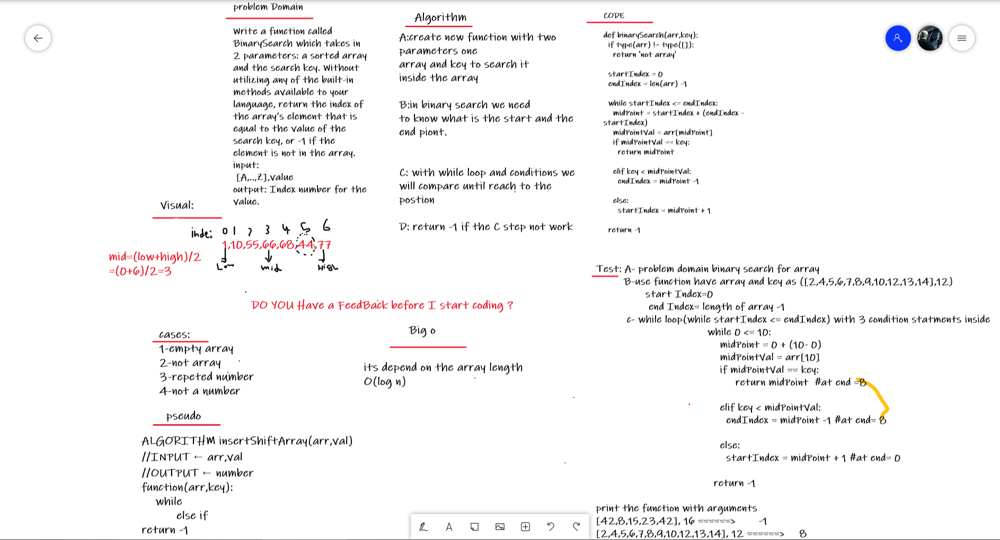

# array-binary-search:
Write a function called BinarySearch which takes in 2 parameters: a sorted array and the search key. Without utilizing any of the built-in methods available to your language, return the index of the array’s element that is equal to the value of the search key, or -1 if the element is not in the array.
NOTE: The search algorithm used in your function should be a binary search.

input:[4, 8, 15, 16, 23, 42], 15 output: 2

Stretch Goal
What would you need to change if the array contained objects (sorted on a given property), and you were searching for certain property value? Write out the pseudocode.

## Whiteboard Process:

## Approach & Efficiency:
I finish with one solution the time for the solution depends on the array length but its going with a linear way.