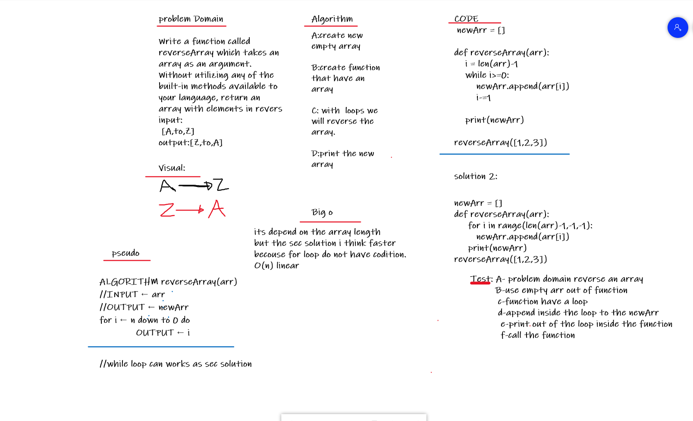

# Reverse an Array
Write a function called reverseArray which takes an array as an argument. Without utilizing any of the built-in methods available to your language, return an array with elements in reversed order.

Utilize the Single-responsibility principle: any methods you write should be clean, reusable, abstract component parts to the whole challenge. You will be given feedback and marked down if you attempt to define a large, complex algorithm in one function definition.

Stretch Goal
Once you’ve achieved a working solution, implement the same feature with a different methodology. (Hint: what different techniques do you have when working with arrays? Recursion, loops, indexes, modifying the array input directly…)

In other words, use a different algorithm & pseudocode to solve the same problem. Then compare approaches for efficiency, readability, flexibility, etc.

## Whiteboard Process

## Approach & Efficiency
I finish with two solutions the time for the solutions depends on the array length but the secound solution with for loop was faster i think because the for loop it not have a condition. 