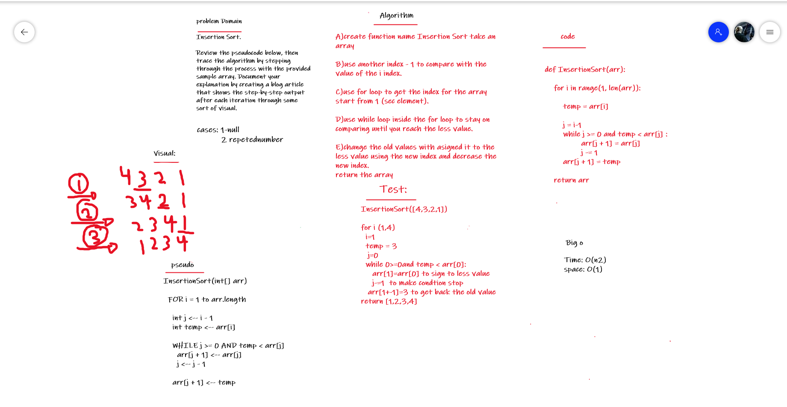

# Challenge Summary
Insertion Sort
Assignment
Review the pseudocode below, then trace the algorithm by stepping through the process with the provided sample array. Document your explanation by creating a blog article that shows the step-by-step output after each iteration through some sort of visual.

Once you are done with your article, code a working, tested implementation of Insertion Sort based on the pseudocode provided.

You may review an example document HERE

```
Pseudocode
  InsertionSort(int[] arr)

    FOR i = 1 to arr.length

      int j <-- i - 1
      int temp <-- arr[i]

      WHILE j >= 0 AND temp < arr[j]
        arr[j + 1] <-- arr[j]
        j <-- j - 1

      arr[j + 1] <-- temp
```

## Whiteboard Process


## Code_link and Blog_link:

[code](https://github.com/Obada-gh/data-structures-and-algorithms-401/blob/main/challenges/Insertion-Sort/insertion_sort/insertion_sort.py)
[Blog](https://github.com/Obada-gh/data-structures-and-algorithms-401/blob/main/challenges/Insertion-Sort/BLOG.md)


## Approach & Efficiency
Time: O(n2)
space: O(1)

## Solution:
```
def InsertionSort(arr):
 
    for i in range(1, len(arr)):
 
        temp = arr[i]
 
        j = i-1
        while j >= 0 and temp < arr[j] :
                arr[j + 1] = arr[j]
                j -= 1
        arr[j + 1] = temp

    return arr

```