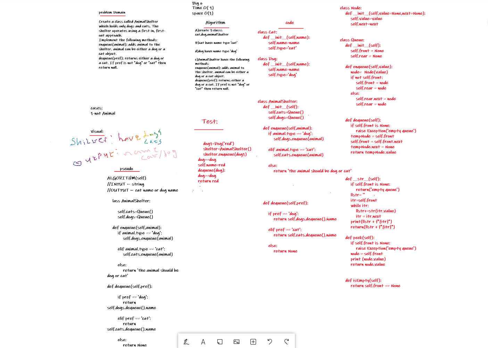

# Challenge Summary
Create a class called AnimalShelter which holds only dogs and cats. The shelter operates using a first-in, first-out approach.
Implement the following methods:
enqueue(animal): adds animal to the shelter. animal can be either a dog or a cat object.
dequeue(pref): returns either a dog or a cat. If pref is not "dog" or "cat" then return null.

## Whiteboard Process


## Code link:
[fifo_animal_shelter](https://github.com/Obada-gh/data-structures-and-algorithms-401/blob/main/challenges/fifo_animal_shelter/fifo_animal_shelter/fifo_animal_shelter.py)

## Approach & Efficiency

Enqueue O(1) When you add an item to a queue, you use the enqueue action. This is done with an O(1) operation in time because it does not matter how many other items live in the queue (n); it takes the same amount of time to perform the operation.

Dequeue O(1) When you remove an item from a queue, you use the dequeue action. This is done with an O(1) operation in time because it doesn’t matter how many other items are in the queue, you are always just removing the front Node of the queue.

## Solution
```
class Node:
    def __init__(self,value=None,next=None):
        self.value=value
        self.next=next 


class Queue:
    def __init__(self):
        self.front = None
        self.rear = None

    def enqueue(self,value):
        node=  Node(value)
        if not self.front:
            self.front = node
            self.rear = node
        else:
            self.rear.next = node
            self.rear = node


    def dequeue(self):
        if self.front is None:
            raise Exception('empty queue')
        tempNode = self.front
        self.front = self.front.next
        tempNode.next = None
        return tempNode.value


        
    
    def __str__(self):
        if self.front is None:
            return('empty queue')
        llstr= ''
        itr=self.front
        while itr:
            llstr+=str(itr.value)
            itr = itr.next
        print(llstr + f"{itr}")
        return(llstr + f"{itr}")

    def peek(self):
        if self.front is None:
            raise Exception('empty queue')
        node = self.front
        print (node.value)
        return node.value

    
    def isEmpty(self):
        return self.front == None

class Cat:
    def __init__(self,name):
        self.name=name
        self.type='cat'

class Dog:
    def __init__(self,name):
        self.name=name
        self.type='dog'

    


class AnimalShelter:
    def __init__(self):
        self.cats=Queue()
        self.dogs=Queue()
        
    def enqueue(self,animal):
        if animal.type == 'dog':
            self.dogs.enqueue(animal)
        
        elif animal.type == 'cat':
            self.cats.enqueue(animal)

        else:
            return 'the animal should be dog or cat'

    
        
        

    def dequeue(self,pref):

        if pref == 'dog':
            return self.dogs.dequeue().name
        
        elif pref == 'cat':
            return self.cats.dequeue().name

        else:
            return None


if __name__ == "__main__":
    dog1=Dog('red')
    dog2=Dog('blue')
    cat1=Cat('lol')
    cat2=Cat('king')
    shelter=AnimalShelter()
    shelter.enqueue(dog1)
    shelter.enqueue(dog2)
    shelter.enqueue(cat1)
    shelter.enqueue(cat2)
    print(shelter.dequeue('dog'))
    print(shelter.dequeue('cat'))
```    