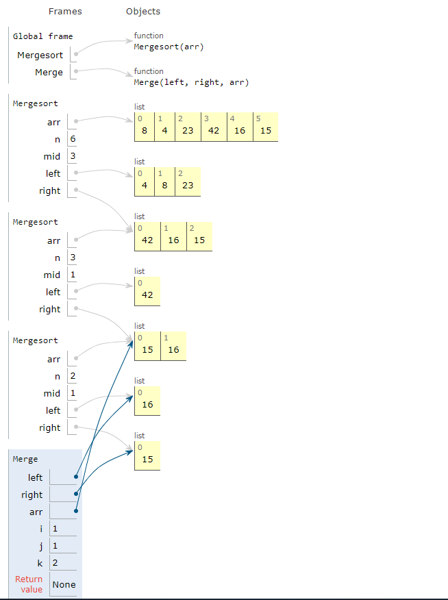
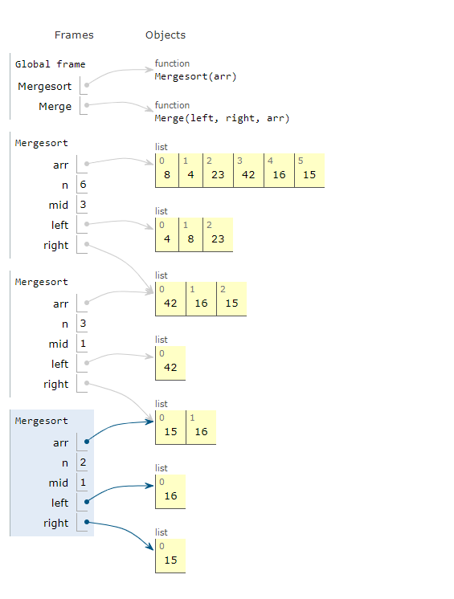
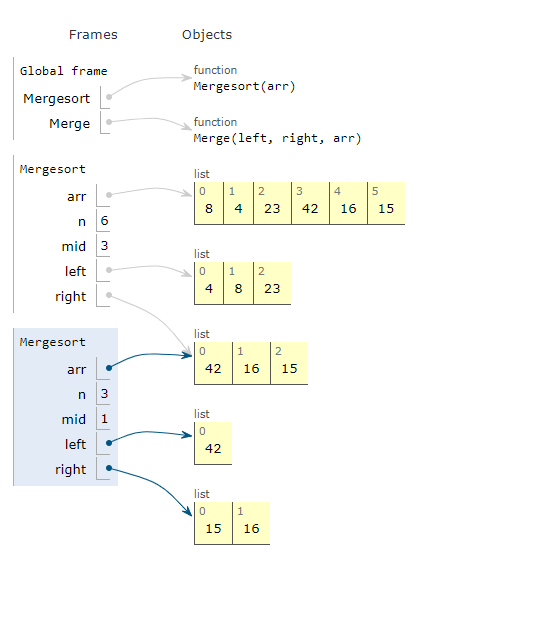
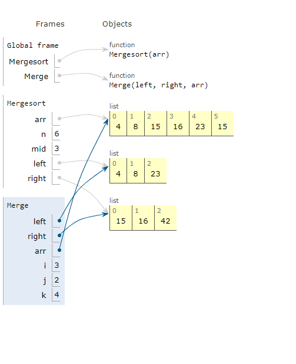
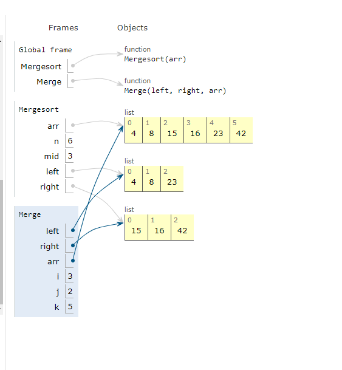

# merge-sort:
Insertion sort is a simple sorting algorithm that works similar to the way you sort playing cards in your hands. The array is virtually split into a sorted and an unsorted part. Values from the unsorted part are picked and placed at the correct position in the sorted part.

# Pseudocode:

```
  InsertionSort(int[] arr)

    FOR i = 1 to arr.length

      int j <-- i - 1
      int temp <-- arr[i]

      WHILE j >= 0 AND temp < arr[j]
        arr[j + 1] <-- arr[j]
        j <-- j - 1

      arr[j + 1] <-- temp
```

# Trace:

Sample Array: [8,4,23,42,16,15]

pass1:



Let us loop for i = 1 (second element of the array) to 6 (last element of the array)
i = 1. Since 4 is smaller than 8, move 4 and insert 4 before 8 


pass2:



Let us loop for i = 2 (second element of the array) to 6 (last element of the array)
i = 1. Since 23 is smaller than 42, stay.


pass3:



Let us loop for i = 3 (second element of the array) to 6 (last element of the array)
i = 1. Since 42 is bigger than 42, stay.


pass4:



Let us loop for i = 4 (second element of the array) to 6 (last element of the array)
i = 1. Since 16 is smaller than 42, move 16 and insert 16 before 23


pass5:



Let us loop for i = 5 (second element of the array) to 6 (last element of the array)
i = 1. Since 15 is smaller than 16, move 15 and insert 15 before 16

# Efficency:

Time: O(n^2)
The basic operation of this algorithm is comparison. This will happen n * (n-1) number of times…concluding the algorithm to be n squared.
Space: O(1)
No additional space is being created. This array is being sorted in place…keeping the space at constant O(1).
