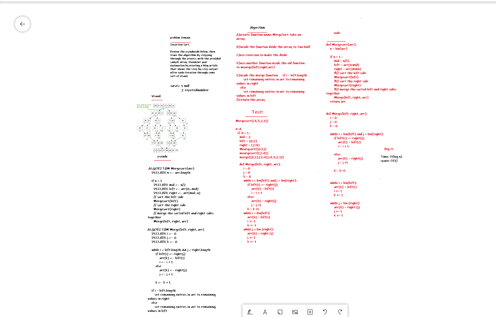

# Challenge Summary

Merge Sort

Assignment
Review the pseudocode below, then trace the algorithm by stepping through the process with the provided sample array. Document your explanation by creating a blog article that shows the step-by-step output after each iteration through some sort of visual.

Once you are done with your article, code a working, tested implementation of Merge Sort based on the pseudocode provided.

```
Pseudocode
ALGORITHM Mergesort(arr)
    DECLARE n <-- arr.length

    if n > 1
      DECLARE mid <-- n/2
      DECLARE left <-- arr[0...mid]
      DECLARE right <-- arr[mid...n]
      // sort the left side
      Mergesort(left)
      // sort the right side
      Mergesort(right)
      // merge the sorted left and right sides together
      Merge(left, right, arr)

ALGORITHM Merge(left, right, arr)
    DECLARE i <-- 0
    DECLARE j <-- 0
    DECLARE k <-- 0

    while i < left.length && j < right.length
        if left[i] <= right[j]
            arr[k] <-- left[i]
            i <-- i + 1
        else
            arr[k] <-- right[j]
            j <-- j + 1

        k <-- k + 1

    if i = left.length
       set remaining entries in arr to remaining values in right
    else
       set remaining entries in arr to remaining values in left
```

## Whiteboard Process


## Code_link and Blog_link:

1- [code](https://github.com/Obada-gh/data-structures-and-algorithms-401/blob/main/challenges/merge-sort/merge-sort/merge_sort/merge_sort.py)
2- [Blog](https://github.com/Obada-gh/data-structures-and-algorithms-401/blob/main/challenges/merge-sort/merge-sort/BLOG.md)


## Approach & Efficiency

Time Complexity: Sorting arrays on different machines. Merge Sort is a recursive algorithm and time complexity can be expressed as following recurrence relation. 
T(n) = 2T(n/2) + θ(n)

The above recurrence can be solved either using the Recurrence Tree method or the Master method. It falls in case II of Master Method and the solution of the recurrence is θ(nLogn). Time complexity of Merge Sort is  θ(nLogn) in all 3 cases (worst, average and best) as merge sort always divides the array into two halves and takes linear time to merge two halves.
Auxiliary Space: O(n)
Algorithmic Paradigm: Divide and Conquer
Sorting In Place: No in a typical implementation
Stable: Yes

## Solution:
```
def Mergesort(arr):
    n = len(arr)

    if n > 1 :
        mid = n//2
        left = arr[0:mid]
        right = arr[mid:n]
        #// sort the left side
        Mergesort(left)
        #// sort the right side
        Mergesort(right)
        #// merge the sorted left and right sides together
        Merge(left, right, arr)
    return arr


def Merge(left, right, arr):
    i = 0
    j = 0
    k = 0

    while i < len(left) and j < len(right):
        if left[i] <= right[j]:
            arr[k] = left[i]
            i = i + 1
        
        else:
            arr[k] = right[j]
            j = j +1

        k = k +1


    while i < len(left):
        arr[k] = left[i]
        i += 1
        k += 1

    while j < len (right):
        arr[k] = right [j]
        j += 1
        k += 1
```