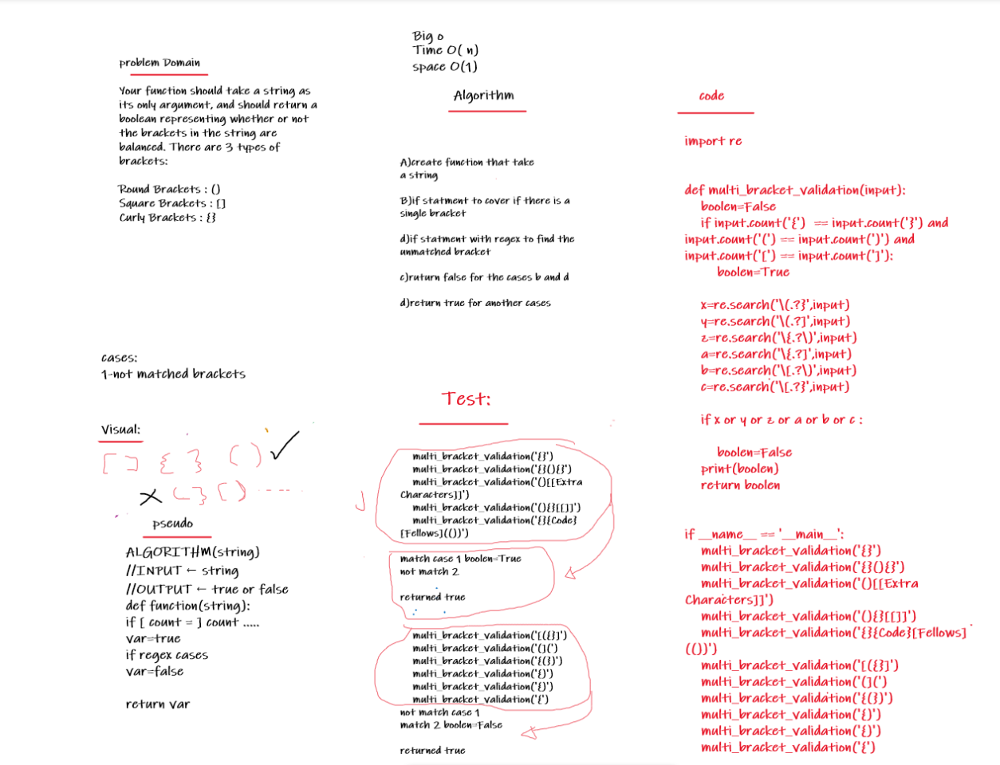

# Challenge Summary
Your function should take a string as its only argument, and should return a boolean representing whether or not the brackets in the string are balanced. There are 3 types of brackets:

Round Brackets : ()
Square Brackets : []
Curly Brackets : {}

## Whiteboard Process:


## Code Link:
## Approach & Efficiency
its depends on the string length its 
time:O(n)
space(1)

## Solution:
```
import re

    
def multi_bracket_validation(input):
    boolen=False
    if input.count('{')  == input.count('}') and input.count('(') == input.count(')') and input.count('[') == input.count(']'):
        boolen=True

    x=re.search('\(.?}',input)
    y=re.search('\(.?]',input)
    z=re.search('\{.?\)',input)
    a=re.search('\{.?]',input)
    b=re.search('\[.?\)',input)
    c=re.search('\[.?}',input)
    
    if x or y or z or a or b or c :
        
        boolen=False
    print(boolen)
    return boolen
    
    


if __name__ == '__main__':
    multi_bracket_validation('{}')
    multi_bracket_validation('{}(){}')
    multi_bracket_validation('()[[Extra Characters]]')
    multi_bracket_validation('(){}[[]]')
    multi_bracket_validation('{}{Code}[Fellows](())')
    multi_bracket_validation('[({}]')
    multi_bracket_validation('(](')
    multi_bracket_validation('{(})')
    multi_bracket_validation('{)')
    multi_bracket_validation('{)')
    multi_bracket_validation('{')

```

    


    


    