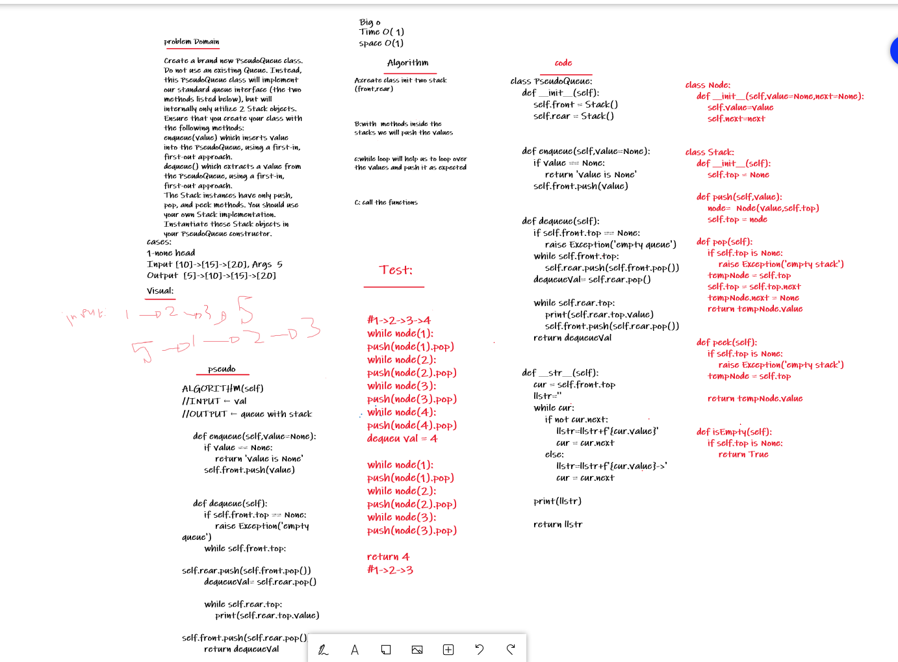

# Challenge Summary
Create a brand new PseudoQueue class. Do not use an existing Queue. Instead, this PseudoQueue class will implement our standard queue interface (the two methods listed below), but will internally only utilize 2 Stack objects. Ensure that you create your class with the following methods:

enqueue(value) which inserts value into the PseudoQueue, using a first-in, first-out approach.
dequeue() which extracts a value from the PseudoQueue, using a first-in, first-out approach.
The Stack instances have only push, pop, and peek methods. You should use your own Stack implementation. Instantiate these Stack objects in your PseudoQueue constructor.

## Whiteboard Process


## code link:
[queue-with-stacks](https://github.com/Obada-gh/data-structures-and-algorithms-401/blob/main/challenges/queue_with_stacks/queue_with_stacks/queue_with_stacks.py)

## Approach & Efficiency
Push O(1) Pushing a Node onto a stack will always be an O(1) operation. This is because it takes the same amount of time no matter how many Nodes (n) you have in the stack.

Pop O(1) Popping a Node off a stack is the action of removing a Node from the top. When conducting a pop, the top Node will be re-assigned to the Node that lives below and the top Node is returned to the user.

Typically, you would check isEmpty before conducting a pop. This will ensure that an exception is not raised. Alternately, you can wrap the call in a try/catch block.

Peek O(1) When conducting a peek, you will only be inspecting the top Node of the stack.

Typically, you would check isEmpty before conducting a peek. This will ensure that an exception is not raised. Alternately, you can wrap the call in a try/catch block.

Here is the pseudocode for a peek

IsEmpty O(1) Here is the pseudocode for isEmpty

Enqueue O(1) When you add an item to a queue, you use the enqueue action. This is done with an O(1) operation in time because it does not matter how many other items live in the queue (n); it takes the same amount of time to perform the operation.

Dequeue O(1) When you remove an item from a queue, you use the dequeue action. This is done with an O(1) operation in time because it doesn’t matter how many other items are in the queue, you are always just removing the front Node of the queue.

Peek O(1) When conducting a peek, you will only be inspecting the front Node of the queue.

Typically, you want to check isEmpty before conducting a peek. This will ensure that an exception is not raised. Alternately, you can wrap the call in a try/catch block.

## Solution
```
class Node:
    def __init__(self,value=None,next=None):
        self.value=value
        self.next=next


class Stack:
    def __init__(self):
        self.top = None

    def push(self,value):
        node=  Node(value,self.top)
        self.top = node

    def pop(self):
        if self.top is None:
            raise Exception('empty stack')
        tempNode = self.top
        self.top = self.top.next
        tempNode.next = None
        return tempNode.value


    def peek(self):
        if self.top is None:
            raise Exception('empty stack')
        tempNode = self.top
        
        return tempNode.value

    
    def isEmpty(self):
        if self.top is None:
            return True

    
class PseudoQueue:
    def __init__(self):
        self.front = Stack()
        self.rear = Stack()
        

    def enqueue(self,value=None):
        if value == None:
            return 'value is None'
        self.front.push(value)


    def dequeue(self):
        if self.front.top == None:
            raise Exception('empty queue')
        while self.front.top:
            self.rear.push(self.front.pop())
        dequeueVal= self.rear.pop()

        while self.rear.top:
            print(self.rear.top.value)
            self.front.push(self.rear.pop())
        return dequeueVal

    
    def __str__(self):
        cur = self.front.top
        llstr=''
        while cur:
            if not cur.next:
                llstr=llstr+f'{cur.value}'
                cur = cur.next
            else:
                llstr=llstr+f'{cur.value}->'
                cur = cur.next
            
        print(llstr)

        return llstr

    

        
  


    def peek(self):
        if self.front is None:
            raise Exception('empty queue')
        node = self.front
        print (node.value)
        return node.value

    
    def isEmpty(self):
        return self.front == None


if __name__ == '__main__':
    queue = PseudoQueue()
    queue.enqueue(1)
    queue.enqueue(2)
    queue.enqueue(3)
    queue.enqueue(4)
    queue.dequeue()
    queue.__str__()

```