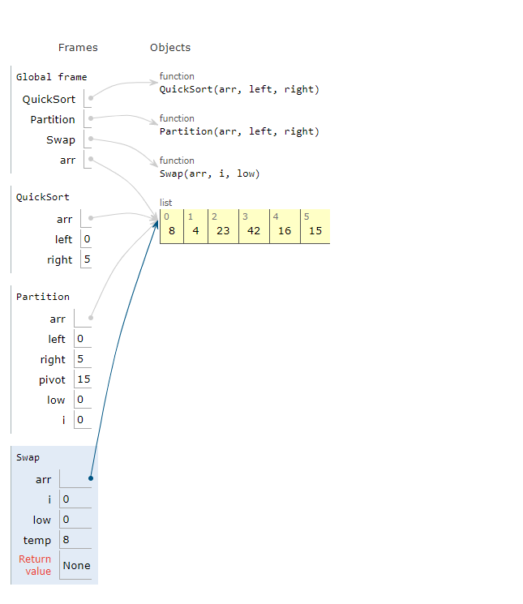
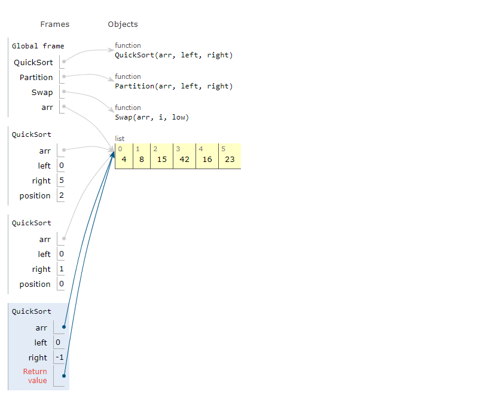

# quick_sort:

QuickSort is a Divide and Conquer algorithm. It picks an element as pivot and partitions the given array around the picked pivot. There are many different versions of quickSort that pick pivot in different ways. 

* Always pick first element as pivot.
* Always pick last element as pivot (implemented below)
* Pick a random element as pivot.
* Pick median as pivot.
The key process in quickSort is partition(). Target of partitions is, given an array and an element x of array as pivot, put x at its correct position in sorted array and put all smaller elements (smaller than x) before x, and put all greater elements (greater than x) after x. All this should be done in linear time.

# Pseudocode:
```
ALGORITHM QuickSort(arr, left, right)
    if left < right
        // Partition the array by setting the position of the pivot value
        DEFINE position <-- Partition(arr, left, right)
        // Sort the left
        QuickSort(arr, left, position - 1)
        // Sort the right
        QuickSort(arr, position + 1, right)

ALGORITHM Partition(arr, left, right)
    // set a pivot value as a point of reference
    DEFINE pivot <-- arr[right]
    // create a variable to track the largest index of numbers lower than the defined pivot
    DEFINE low <-- left - 1
    for i <- left to right do
        if arr[i] <= pivot
            low++
            Swap(arr, i, low)

     // place the value of the pivot location in the middle.
     // all numbers smaller than the pivot are on the left, larger on the right.
     Swap(arr, right, low + 1)
    // return the pivot index point
     return low + 1

ALGORITHM Swap(arr, i, low)
    DEFINE temp;
    temp <-- arr[i]
    arr[i] <-- arr[low]
    arr[low] <-- temp
```

# Trace:

Sample Array: [8,4,23,42,16,15]

pass1:





pass2:


pass3:


pass4:


pass5:


pass6:





pass7:


pass8:


pass9:


pass10:


pass11:


pass12:


pass13:


pass14:


pass15:


pass16:


# Efficency:

time:big o(n)
space: big o(1)

Why Quick Sort is preferred over MergeSort for sorting Arrays 
Quick Sort in its general form is an in-place sort (i.e. it doesn’t require any extra storage) whereas merge sort requires O(N) extra storage, N denoting the array size which may be quite expensive. Allocating and de-allocating the extra space used for merge sort increases the running time of the algorithm. Comparing average complexity we find that both type of sorts have O(NlogN) average complexity but the constants differ. For arrays, merge sort loses due to the use of extra O(N) storage space.
Most practical implementations of Quick Sort use randomized version. The randomized version has expected time complexity of O(nLogn). The worst case is possible in randomized version also, but worst case doesn’t occur for a particular pattern (like sorted array) and randomized Quick Sort works well in practice.
Quick Sort is also a cache friendly sorting algorithm as it has good locality of reference when used for arrays.
Quick Sort is also tail recursive, therefore tail call optimizations is done.


