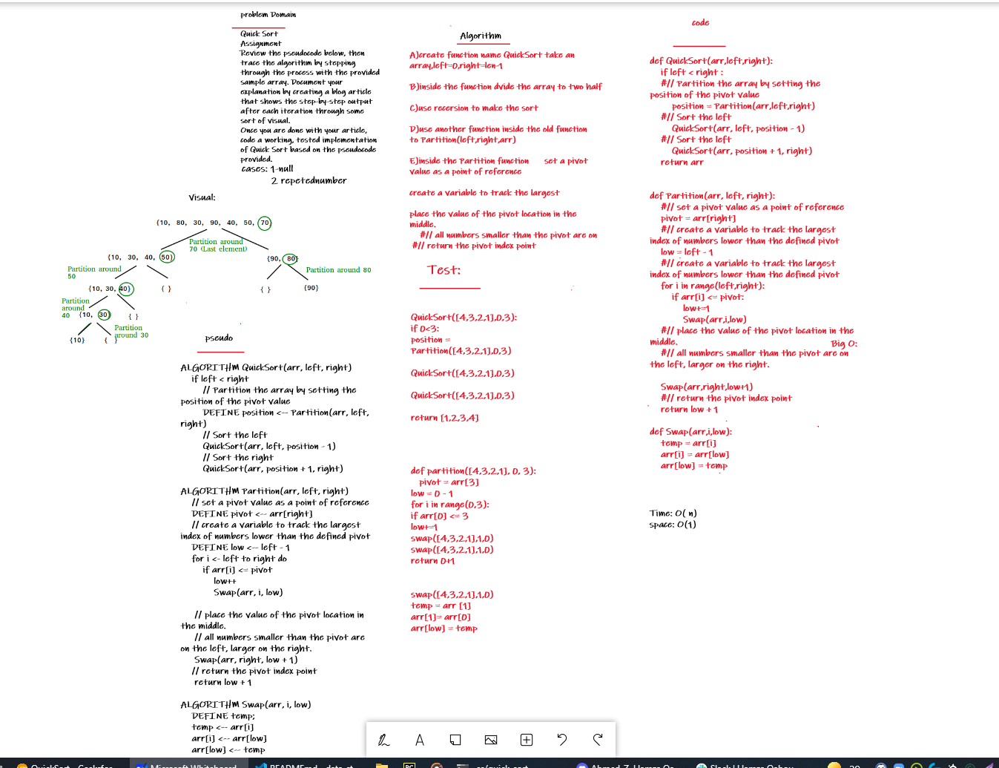

# Challenge Summary

quick-sort:

Assignment
Review the pseudocode below, then trace the algorithm by stepping through the process with the provided sample array. Document your explanation by creating a blog article that shows the step-by-step output after each iteration through some sort of visual.

Once you are done with your article, code a working, tested implementation of Quick Sort based on the pseudocode provided.

You may review an example document HERE

```
Pseudo Code:

ALGORITHM QuickSort(arr, left, right)
    if left < right
        // Partition the array by setting the position of the pivot value
        DEFINE position <-- Partition(arr, left, right)
        // Sort the left
        QuickSort(arr, left, position - 1)
        // Sort the right
        QuickSort(arr, position + 1, right)

ALGORITHM Partition(arr, left, right)
    // set a pivot value as a point of reference
    DEFINE pivot <-- arr[right]
    // create a variable to track the largest index of numbers lower than the defined pivot
    DEFINE low <-- left - 1
    for i <- left to right do
        if arr[i] <= pivot
            low++
            Swap(arr, i, low)

     // place the value of the pivot location in the middle.
     // all numbers smaller than the pivot are on the left, larger on the right.
     Swap(arr, right, low + 1)
    // return the pivot index point
     return low + 1

ALGORITHM Swap(arr, i, low)
    DEFINE temp;
    temp <-- arr[i]
    arr[i] <-- arr[low]
    arr[low] <-- temp
```

## Whiteboard Process


## Code_link and Blog_link:

1- [code](https://github.com/Obada-gh/data-structures-and-algorithms-401/blob/main/challenges/quick-sort/quick_sort/quick_sort.py)
2- [Blog](https://github.com/Obada-gh/data-structures-and-algorithms-401/blob/main/challenges/quick-sort/BLOG.md)


## Approach & Efficiency
time:big o(n)
space: big o(1)

Why Quick Sort is preferred over MergeSort for sorting Arrays 
Quick Sort in its general form is an in-place sort (i.e. it doesn’t require any extra storage) whereas merge sort requires O(N) extra storage, N denoting the array size which may be quite expensive. Allocating and de-allocating the extra space used for merge sort increases the running time of the algorithm. Comparing average complexity we find that both type of sorts have O(NlogN) average complexity but the constants differ. For arrays, merge sort loses due to the use of extra O(N) storage space.
Most practical implementations of Quick Sort use randomized version. The randomized version has expected time complexity of O(nLogn). The worst case is possible in randomized version also, but worst case doesn’t occur for a particular pattern (like sorted array) and randomized Quick Sort works well in practice.
Quick Sort is also a cache friendly sorting algorithm as it has good locality of reference when used for arrays.
Quick Sort is also tail recursive, therefore tail call optimizations is done.


## Solution:
```
def QuickSort(arr,left,right):
    if left < right :
    #// Partition the array by setting the position of the pivot value   
        position = Partition(arr,left,right)
    #// Sort the left
        QuickSort(arr, left, position - 1)
    #// Sort the left
        QuickSort(arr, position + 1, right)
    return arr


def Partition(arr, left, right):
    #// set a pivot value as a point of reference
    pivot = arr[right]
    #// create a variable to track the largest index of numbers lower than the defined pivot
    low = left - 1
    #// create a variable to track the largest index of numbers lower than the defined pivot
    for i in range(left,right):
        if arr[i] <= pivot:
            low+=1
            Swap(arr,i,low)
    #// place the value of the pivot location in the middle.
    #// all numbers smaller than the pivot are on the left, larger on the right.

    Swap(arr,right,low+1)
    #// return the pivot index point
    return low + 1

def Swap(arr,i,low):
    temp = arr[i]
    arr[i] = arr[low]
    arr[low] = temp

```